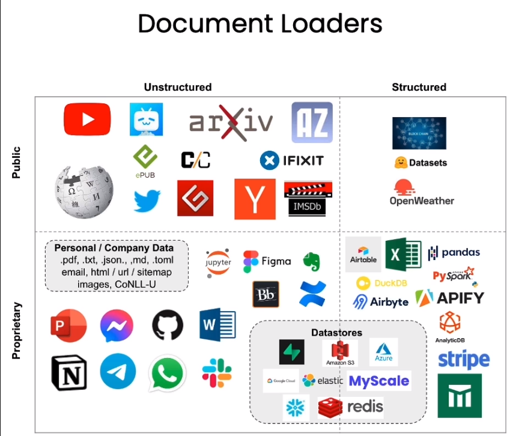
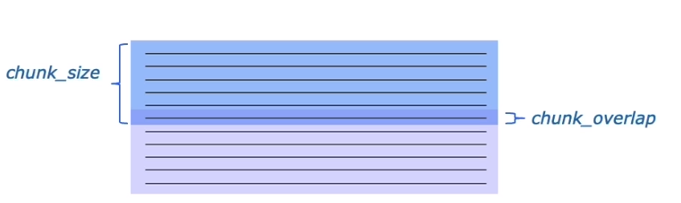
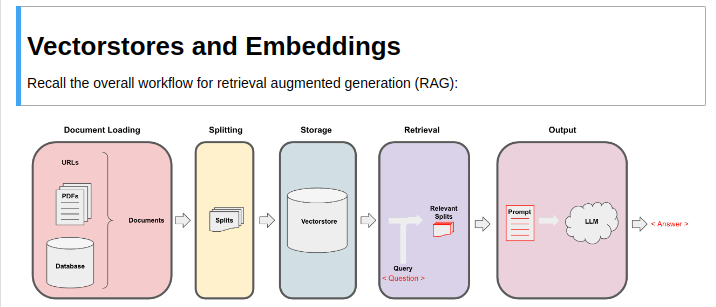
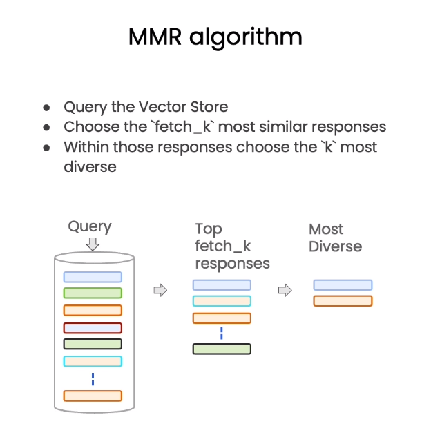
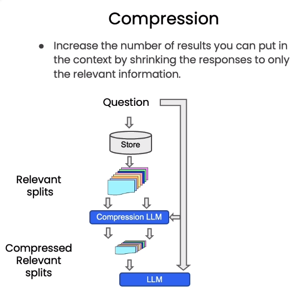

## Overview

Import data (text, pdf, yourtube video, etc) -> split

## Langchain Document loader

Many dfifferent types of document loaders which can be used in langchain. 80+

Some for unstructured data such as text, youtube, epub, titter, etc. Some for structured data such as hugging face datasets or openweather. Some loaders can even handle propietary data, such as evernote or excel.

## Document splitting

Very important to split documents since larger documents will be larger than the max tokens.

Splitting is very importnat. You need to make sure you get the right data into each chunk so that you get semtically correct chunks together. 

Basics of chunk splitting is defining the chunk size and chunk overlap. This means, defining how much text a chunk should be and how much overlap should there be between chunks. Overlap is important for maintaining context between chunks.

### Types of splitting
The basic splitter splits based on # of token, but Langchain has several more purpose build splitters such as one which splits on markdown headers, text character splitter, splitters for programming languages, and more.

Langchain docs for text splitters: https://python.langchain.com/docs/modules/data_connection/document_transformers/#text-splitters
* Split by Chatracter
* Split code
* Split by markdown header
* Recursively split by character (Splits on a list of characters,using the first character but using latters ones if chunks too large)
* Split by token
* Split into sentences: https://api.python.langchain.com/en/latest/text_splitter/langchain.text_splitter.SpacyTextSplitter.html

Another article on text splitters: https://www.pinecone.io/learn/chunking-strategies/

## Vector Stores and Embeddings

Embeddings: Take a piece of text and convert it to numbericla values. Then we can compare the numberical values of two different values to see how similar they are.

Vector store: Store vectors to compare how similar they are

Idea is to give the LLM access to query the vector store and retrive the n most similar vectors so it can pick the right one.

### Vector Retrieval

Basic semantich match works well for many cases, but we ca nalso see many edge cases. One such example is asking "tell me about such and such from chapter 3." The search has no ability to determain if a vector is really from chapter 3 or not, you will get vectors from any where in the vector store which are most similar. 

#### Maximum Marginal Relivence (MMR)
You may not always want to choose the most similar response. MMR is the process of selecting for a diverse set of documents.

First we select k number of most sematiclly similar repsonse -> then select most diverse repsonses

MMR is the process of getting some number of the most similar vectors

#### LLM Aided retrieval
Sometimes we need to query for information with a semantic as well as meta data piece. 

Example: "What are some movies about aliens in 1980"

In this example we need to filter for only movies from 1980, then run our semantic search for movies about aliens. To solve for this, we need to save the movie year in the metadata of our vector store, then we can filter our vector query.

Understnading that we can filter on metadata in a vector query, we can give the LLM the initial question, give the llm the possible metadata filters, and allow the LLM to make the query and specify the needed metadata.

##### Self Querying
<https://js.langchain.com/docs/modules/data_connection/retrievers/how_to/self_query/#:~:text=A%20self%2Dquerying%20retriever%20is,query%20to%20it's%20underlying%20VectorStore.>

The process of letting the LLM query a vector store is reffered to as self-querying. See the above linked docs from langchain.

#### Compression
Pull out only the most relavent parts of a retrieved passage. When querying a vector store, we will retrieve the whole document, often times this contains much more info than we really want to provide. We can use an LLM to compress the info to the most important parts before returning the final answer.

Surce: [Lesson 5 - 3:09](https://learn.deeplearning.ai/langchain-chat-with-your-data/lesson/5/retrieval)

### Question Answering
Ask the LLM a question, LLM looks up the answer and responds.

Basic way of achieving this is just passing everything into one prompt to the LLM, there are a few alternative methods for this process though.

The hard part about this is dealing with large responses which take up too much of the context window. These alteritve methods help solve that problem.

* Map Reduce
* Refine
* Map_rerank

## Conversation

